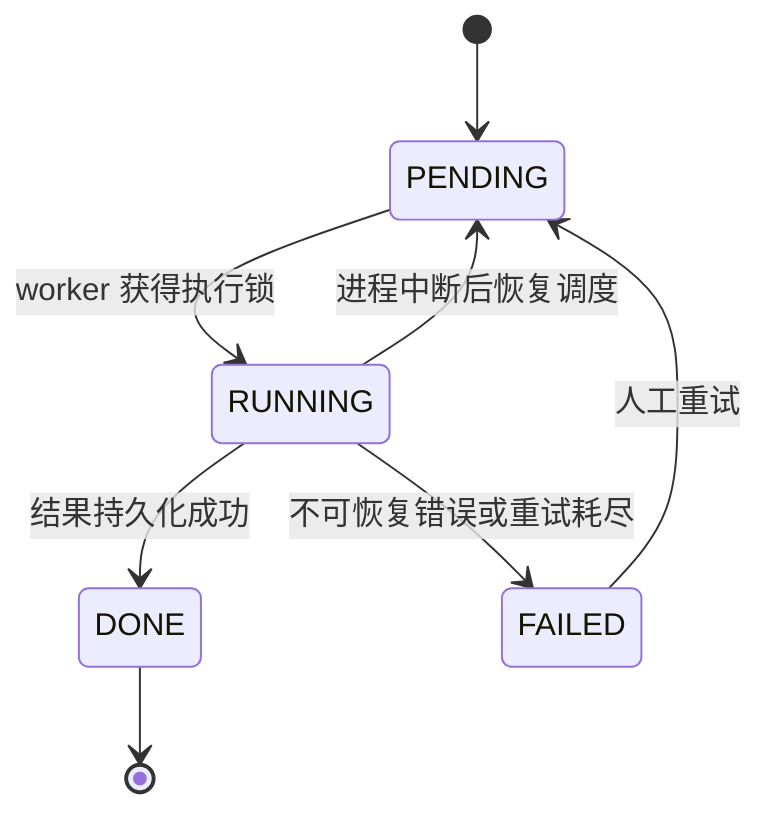

# Alert Triage Agent 功能补全开发计划

> 状态：待实施  
> 基线分支：`feat`  
> 目标：将当前可演示的告警研判 MVP 补全为可稳定交付、可审计、可运营的 SOC 辅助研判能力。

## 1. 目标与完成定义

告警研判 Agent 以 XDR 告警 UUID 为输入，自动获取可追溯证据、可选地进行知识增强，并给出受安全边界约束的研判结论和人工处置建议。它不直接执行封禁、隔离、加白或关闭告警等写操作。

全部完成后应满足：

- 真实 XDR、RAG、LLM 的接口契约均有自动化验证；外部服务故障时有明确、可见的降级结果。
- 同一任务不会被重复执行；进程重启或调用超时后，任务不会永久停留在 `RUNNING`，可恢复或被明确标记失败。
- 研判结论可追溯到 XDR 证据和 RAG 引用，LLM 不可用或输出异常时安全降级。
- 前端会自动反映任务状态、进度和失败原因，并提供受控的人工重试与复核入口。
- 运行耗时、外部依赖故障、结果质量和模型成本可观测、可审计。

## 2. 当前基线与边界

现有实现已经具备 Gateway 创建任务、后台执行 8 节点工作流、XDR 取证、LLM 结构化结果校验、Evidence 结果持久化和前端结果展示。

已知缺口如下：

- `orchestrator/app/clients/rag_client.py` 是占位实现，永远返回降级；前端创建任务时也固定关闭 RAG。
- XDR 客户端单测仍引用旧签名函数，测试与当前 Sangfor SDK 签名实现不一致，尚未形成真实 XDR 契约保障。
- 任务通过 Gateway 进程内协程执行；运行中任务在进程异常时无法自动续跑，也缺少并发幂等保护。
- 前端列表与详情页仅在加载或手动刷新时取数，不能自动展示后台执行进度。
- LLM 输入含外部告警内容，但缺少提示注入隔离、证据引用一致性校验和质量评估集。

本计划不引入自动处置能力，也不改变现有普通任务编排链路。

## 3. 实施阶段

### 阶段 A：外部接口与任务可靠性（P0）

#### A1. 完成 RAG 知识增强

- 以实际 RAG 服务 OpenAPI 为唯一依据确认鉴权、检索路径、请求限制、超时和响应字段；不要假设当前占位注释中的接口可用。
- 将 RAG 响应归一为 `answer`、`citations`、`degraded` 和可安全展示的降级原因。citation 至少包含来源标识、标题或名称、定位信息和摘要。
- 为 RAG 客户端配置连接/读取超时、有限重试和错误分类；超时、不可用、空结果与格式错误均继续研判，但记录不同的降级原因。
- 前端创建区增加“启用知识增强”开关，默认值与部署配置一致；列表与详情准确显示启用状态、降级原因和结构化引用。

验收：启用 RAG 时，成功任务包含至少一条可展示引用；RAG 关闭、超时或返回非法数据时，任务完成但带明确降级标识，不伪造引用。

#### A2. 修复并固化 XDR 契约

- 统一文档、环境变量、客户端实现与测试中的 Sangfor SDK 鉴权命名和签名算法，删除旧 HMAC 签名测试假设。
- 为告警、Proof、资产、事件、事件 Proof 和白名单接口分别建立 fixture 驱动的契约测试，覆盖分页/空数据、认证失败、限流、超时和服务端错误。
- 在可访问的测试 XDR 环境增加最小集成测试：创建预设告警任务并校验各类证据被正确标准化。
- 所有日志、Trace 和 API 错误中不得泄露 AK、SK、Authorization 或完整敏感证据。

验收：XDR 单元测试不再在收集阶段失败；测试环境的真实调用可获取完整证据，并在认证或接口变化时给出可定位错误。

#### A3. 任务状态机、幂等与恢复

任务生命周期统一为：

- 将任务状态、尝试次数、开始/结束时间、当前节点、失败分类和恢复标记持久化；Evidence 保存完整上下文，任务表保存可查询的生命周期摘要。
- 用持久化执行锁或等价的原子条件更新确保同一 `taskId` 同时只能运行一次；重复创建请求按幂等键返回已有任务或明确拒绝。
- 用独立恢复调度扫描超时 `RUNNING` 任务：可安全重试的任务回到 `PENDING`，超过最大尝试次数或无法恢复的任务标为 `FAILED` 并保存原因。
- Gateway 的后台触发只负责投递/唤醒，不承担唯一执行责任；手动运行、自动执行和恢复调度复用同一执行入口。

验收：重复调用运行接口不会产生两次 LLM/XDR 执行；Gateway 或 Orchestrator 重启后，运行中任务在约定时限内恢复或终态化；列表不会永久显示 `RUNNING`。

### 阶段 B：研判安全、质量与可解释性（P1）

#### B1. LLM 输入与输出安全

- 对送入模型的告警、Proof、资产与事件数据实行字段白名单、长度上限和敏感字段脱敏；将外部文本明确标记为“数据而非指令”。
- 将结构化输出解析、Schema 校验、枚举/置信度限制和建议动作等级校验集中到一个结果校验器；非法输出必须转为安全降级结论。
- 新增证据一致性检查：结论中的关键断言必须能关联到已采集 XDR 证据或 RAG citation；不满足时降低置信度并记录校验错误。
- 保留模型、Token 用量、降级原因和版本信息，但不在 Trace 中保存完整密钥或超出审计必要范围的敏感原文。

验收：包含提示注入文本、超长字段、非 JSON 输出、非法动作等级和无引用高置信结论的输入均不能导致越权动作或高置信误判。

#### B2. 建立质量评估基线

- 建立经脱敏的基准告警集，至少覆盖真阳性、误报、可疑、证据不足、白名单命中、RAG 不可用和 XDR 部分证据缺失。
- 为每个样本保存预期 verdict、允许的置信度区间、必须出现的证据类型和禁止的建议动作。
- 在 CI 中运行离线图节点/契约测试；使用固定模型或录制响应运行可复现的回归评估，真实模型评估作为受控集成作业。
- 发布前记录 verdict 一致性、降级率、外部依赖失败率与人工复核采纳率，作为模型/提示词变更的准入指标。

验收：每次变更都可比较研判质量；关键安全样本不出现回归，质量指标有明确基线和告警阈值。

### 阶段 C：前端体验与人工闭环（P1）

- 任务列表与详情页在 `PENDING`、`RUNNING` 状态下自动轮询，终态后停止；优先复用现有事件接口展示当前节点和最近事件，失败时展示分类后的原因与建议。
- 创建任务后立即跳转或突出显示新任务，防止用户重复提交；运行中禁用重复运行，终态任务只允许符合策略的人工重试。
- 在详情页结构化展示 XDR 证据摘要、RAG 引用、校验/降级原因、建议动作理由和任务时间线；避免以截断 JSON 作为主交互。
- 增加人工复核表单：分析人员可记录确认/驳回、备注和选择的建议动作；反馈仅写审计记录，不能直接触发高风险处置。

验收：不手动刷新也能看到状态变化；失败任务可定位依赖或校验问题；每个最终结论都可由人工给出复核反馈并追溯。

### 阶段 D：可观测性、报告与运营（P1/P2）

- 采集按依赖区分的调用量、成功率、耗时、超时、重试、降级率、队列等待时间、恢复次数和 LLM Token/成本指标。
- 为 XDR、RAG、LLM、Evidence 和执行调度分别提供健康状态与告警阈值；失败日志关联 `taskId`、当前节点和可公开的错误码。
- 补全研判报告：包含结论、证据、RAG 引用、人工复核、模型/提示词版本、执行时间线和降级说明，并支持受权限控制的导出。
- 定义数据保留和脱敏规则，限制报告、Trace 与审计记录的访问权限；保留期限与实际部署合规要求对齐。

验收：运营人员可在不查看容器日志的情况下定位失败依赖、识别质量下降并导出完整审计报告。

## 4. 交付顺序与依赖

1. 先完成 A2（XDR 契约）与 A3（任务可靠性），以稳定证据输入和执行状态为基础。
2. 完成 A1（RAG）后，再实施 B1 的引用一致性校验，避免以空引用设计评估逻辑。
3. B2 与 C 可并行推进；人工复核产生的反馈进入 B2 的质量评估闭环。
4. D 在前三阶段已有统一状态、错误分类和审计字段后接入，避免重复采集口径。

每个阶段必须通过对应验收项、相关单元测试、服务契约测试和 Docker 全栈冒烟验证后再进入下一阶段。

## 5. 测试与发布门禁

- 单元测试：RAG 响应归一、XDR 签名/响应解析、状态迁移、幂等锁、结果安全校验、前端轮询与状态渲染。
- 集成测试：XDR/RAG/LLM/Evidence 可用、超时和降级场景；任务在重启与重复提交条件下的恢复行为。
- 端到端测试：从预设告警创建任务到查看结论、证据、引用、失败提示与人工复核记录。
- 回归验证：`python3 -m compileall`、相关 Python 测试、`npm --prefix frontend run build`、`docker compose config` 及 Docker 全栈冒烟。
- 发布前置条件：所有 P0 项通过；不存在长期 `RUNNING` 任务；XDR/RAG/LLM 依赖健康；高风险动作仍只能人工确认。

## 6. 风险与决策记录

- RAG 的真实服务契约尚未确认，实施前必须取得 OpenAPI 或由服务负责人提供稳定接口；未确认前不得把占位地址当作生产协议。
- 真实 XDR 的字段、分页和签名规范可能与 Mock 不同，必须以测试环境契约结果为准。
- 恢复调度可能引入重复执行风险，因此持久化锁与幂等键是前置条件。
- LLM 结论只能作为辅助决策；人工复核与审计记录是功能边界的一部分，而非后续可选项。
